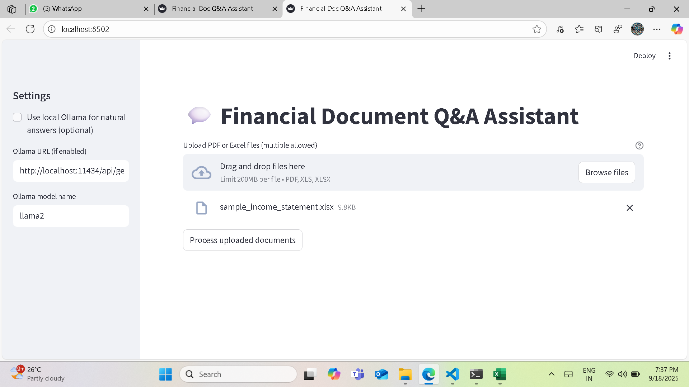
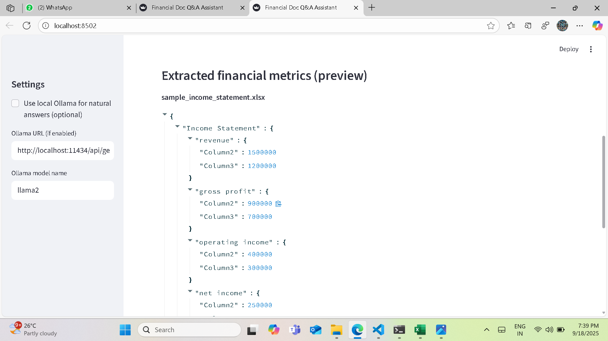
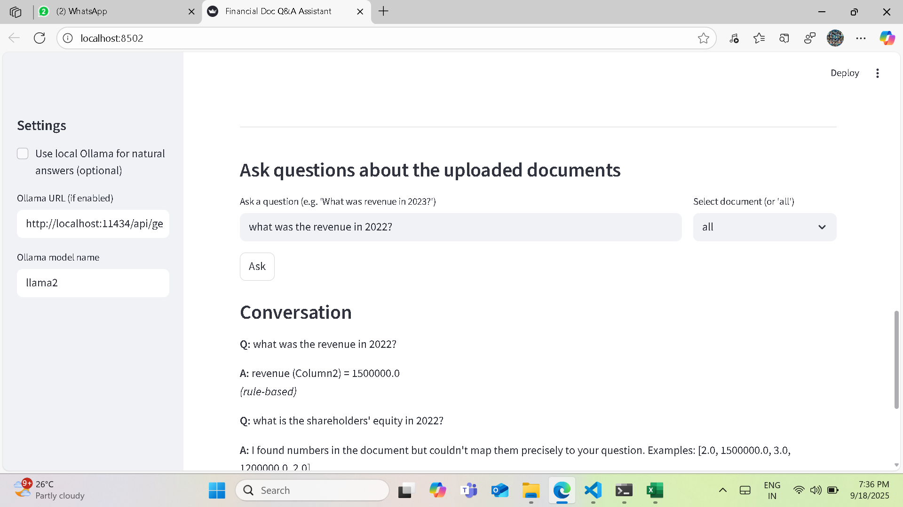

# Financial Document Q&A Assistant
A lightweight Streamlit app to analyze financial documents and answer questions instantly.

## Overview
This small Streamlit app accepts PDF and Excel financial documents, extracts text and tables, normalizes key financial metrics (Income Statement / Balance Sheet / Cash Flow), and provides a simple question-answer interface. Optionally integrates with a **local Ollama** model for richer conversational answers.

## Features
- Upload PDF or Excel files
- Extract text and tables using `pdfplumber` and `pandas`
- Heuristic extraction of common metrics (revenue, net income, total assets)
- Rule-based Q&A for fast, offline responses
- Optional: connect to a local Ollama API for natural language answers

## Quick Setup (Linux / Windows / Mac)

1. Clone the repo and create a virtual environment:

```bash
git clone https://github.com/boddupallykavya9-cloud/FINANCIAL_DOC_QA_ASSISTANT.git
cd FINANCIAL_DOC_QA_ASSISTANT
python -m venv venv
# Activate venv
# Linux / Mac:
source venv/bin/activate
# Windows:
venv\Scripts\activate

2. Install dependencies:


pip install -r requirements.txt

3. Run the app:


streamlit run app.py

Screenshots

Upload & Processing


Extracted Metrics


Q&A Example



Dependencies

Python 3.10+

pandas

pdfplumber

streamlit

(Optional) requests, Ollama API


Author

Boddupally Kavya